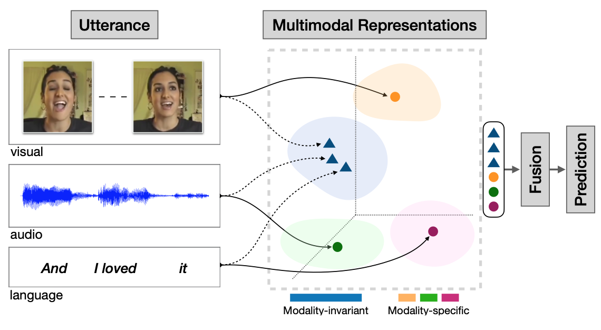

# Multimodal Deep Learning

Announcing the multimodal deep learning repository that contains implementation of various deep learning-based models to solve different multimodal problems such as multimodal representation learning, multimodal fusion for downstream tasks e.g., multimodal sentiment analysis.

- [Models](#models)
  * [MISA (PyTorch)](#MISA-Modality--Invariant-and--Specific-Representations-for-Multimodal-Sentiment-Analysis)
  * [BBFN (PyTorch)](#bbfn)
  * [Multimodal-Infomax (PyTorch)](#Multimodal-Infomax)
  
  
#Models

## MISA: Modality-Invariant and -Specific Representations for Multimodal Sentiment Analysis
Code for the [ACM MM 2020](https://2020.acmmm.org) paper [MISA: Modality-Invariant and -Specific Representations for Multimodal Sentiment Analysis](https://arxiv.org/pdf/2005.03545.pdf)


<p align="center">
  
</p>


### Setup the environment

We work with a conda environment.

```
conda env create -f environment.yml
conda activate misa-code
```

### Data Download

- Install [CMU Multimodal SDK](https://github.com/A2Zadeh/CMU-MultimodalSDK). Ensure, you can perform ```from mmsdk import mmdatasdk```.    
- Option 1: Download [pre-computed splits](https://drive.google.com/drive/folders/1IBwWNH0XjPnZWaAlP1U2tIJH6Rb3noMI?usp=sharing) and place the contents inside ```datasets``` folder.     
- Option 2: Re-create splits by downloading data from MMSDK. For this, simply run the code as detailed next.

### Running the code

1. ```cd src```
2. Set ```word_emb_path``` in ```config.py``` to [glove file](http://nlp.stanford.edu/data/glove.840B.300d.zip).
3. Set ```sdk_dir``` to the path of CMU-MultimodalSDK.
2. ```python train.py --data mosi```. Replace ```mosi``` with ```mosei``` or ```ur_funny``` for other datasets.

### Citation

If this paper is useful for your research, please cite us at:

```
@article{hazarika2020misa,
  title={MISA: Modality-Invariant and-Specific Representations for Multimodal Sentiment Analysis},
  author={Hazarika, Devamanyu and Zimmermann, Roger and Poria, Soujanya},
  journal={arXiv preprint arXiv:2005.03545},
  year={2020}
}
```

### Contact

For any questions, please email at [hazarika@comp.nus.edu.sg](mailto:hazarika@comp.nus.edu.sg)

## Bi-Bimodal Modality Fusion for Correlation-Controlled Multimodal Sentiment Analysis

This repository contains official implementation of the paper: [Bi-Bimodal Modality Fusion for Correlation-Controlled Multimodal Sentiment Analysis (ICMI 2021)](https://arxiv.org/abs/2107.13669)

### Model Architecture

Overview of our Bi-Bimodal Fusion Network (BBFN). It learns two text-related pairs of representations, text-acoustic and text-visual by enforcing each pair of modalities to complement mutually. Finally, the four (two pairs) head representations are concatenated
to generate the final prediction.


A single complementation layer: two identical pipelines (left and right) propagate the main modality and fuse that
with complementary modality with regularization and gated control.


### Results

Results on the test set of CMU-MOSI and CMU-MOSEI dataset. Notation: △ indicates results in the corresponding line are excerpted from previous papers; † means the results are reproduced with publicly visible source code and applicable hyperparameter setting; ‡ shows the results have experienced paired t-test with 𝑝 < 0.05 and demonstrate significant improvement over MISA, the state-of-the-art model.


### Usage
1. Set up conda environemnt
```
conda env create -f environment.yml
conda activate BBFN
```

2. Install [CMU Multimodal SDK](https://github.com/A2Zadeh/CMU-MultimodalSDK)

3. Set `sdk_dir` in `src/config.py` to the path of CMU-MultimodalSDK

4. Train the model
```
cd src
python main.py --dataset <dataset_name> --data_path <path_to_dataset>
```
We provide a script `scripts/run.sh` for your reference.

### Citation
Please cite our paper if you find our work useful  for your research:
```bibtex
@article{han2021bi,
  title={Bi-Bimodal Modality Fusion for Correlation-Controlled Multimodal Sentiment Analysis},
  author={Han, Wei and Chen, Hui and Gelbukh, Alexander and Zadeh, Amir and Morency, Louis-philippe and Poria, Soujanya},
  journal={ICMI 2021},
  year={2021}
}
```

### Contact 
Should you have any question, feel free to contact me through [henryhan88888@gmail.com](henryhan88888@gmail.com)


